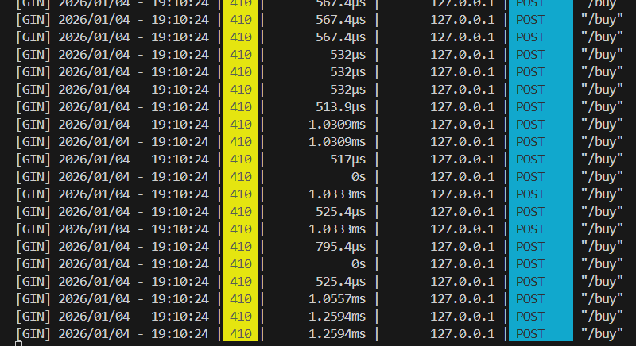
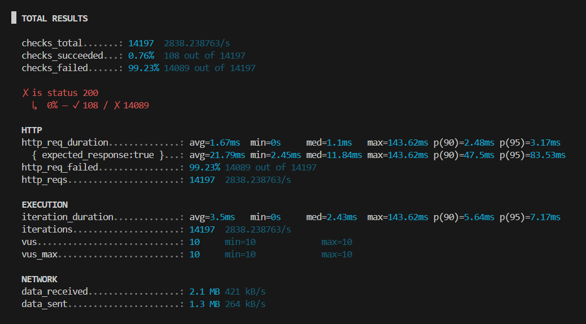
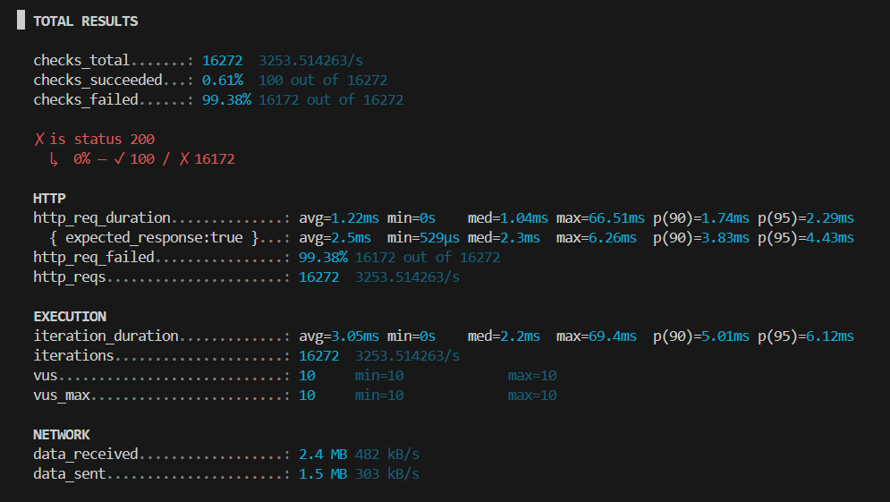

# TicketBlitz: High-Concurrency Reservation Engine

**TicketBlitz** is a backend system designed to simulate a high-traffic flash sale (concert ticket reservation). The goal of this project is to demonstrate, diagnose, and solve **distributed race conditions** that occur when thousands of users contend for limited inventory simultaneously.

## Phase 1: The Vulnerable Implementation

This demonstrates how standard database transactions fail under high concurrency.

## 🏗️ Architecture & Tech Stack
* **Language:** Go (Golang 1.25)
* **Framework:** Gin (HTTP Web Framework)
* **Database:** PostgreSQL (Persistence)
* **Caching/Locking:** Redis + Lua Scripting (Atomic Counters)
* **Infrastructure:** Docker & Docker Compose
* **Testing:** K6 (Load Testing)

## 📂 Project Structure
Refactored to follow the **Standard Go Project Layout** for maintainability and scalability.

```text
ticket-blitz/
├── cmd/
│   └── server/
│       └── main.go        # Application entry point (Wires Repos + Handlers)
├── internal/
│   ├── handlers/          # HTTP Layer: Handles Requests/Responses (Gin)
│   └── repository/        # Data Layer: Postgres Queries & Redis Lua Scripts
├── docker-compose.yml     # Infrastructure (DB + Cache + Queue)
└── go.mod                 # Dependencies
```

## 🚀 Getting Started

### 1. Infrastructure Setup
The system uses Docker to manage the database, ensuring a clean environment.

```bash
docker-compose up -d
```

Status: Infrastructure is running. *(Use the screenshot showing your Docker containers running green.)*

### 2. The Vulnerable Endpoint

The initial implementation uses a naive **Read → Check → Modify** strategy:

- Read current stock from PostgreSQL.
- Check if `stock > 0`.
- Update database with `stock = stock - 1`.

While logical for a single user, this approach is **not atomic** under high concurrency.

### Try it locally

Start the Go backend using the following command.

```bash
go run cmd/server/main.go
```

Reset the demo inventory, and simulate a purchase. Run in a different terminal.
```
curl -X POST http://localhost:9090/reset

curl -X POST http://localhost:9090/buy
```

Notes:

- Ensure `docker-compose` and `go` are installed and available on your PATH.
- If your service uses a different port, update the URLs above accordingly.

## 💥 The Exploit: Simulating Race Conditions

To prove the vulnerability, we use **K6** to simulate a traffic spike.

### Attack Configuration

- **Scenario:** 10 Virtual Users (VUs) hitting the `buy` endpoint simultaneously.
- **Duration:** 5 seconds.
- **Initial Inventory:** 100 tickets.

### Execution

Run the K6 attack script against the Go backend:

```bash
k6 run attack.js
```

## 📉 The Result: Overselling

The system fails to maintain data integrity. Despite having a hard limit of **100 tickets**, the system successfully processes **108 sales**.




 
- **Analysis:** The 8 extra tickets are sold because multiple requests read the same stock count (for example, "1 remaining") at nearly the same microsecond before any of them can commit the decrement transaction.

## Phase 2: The Solution (Redis + Lua)
To fix the race condition, I migrated the inventory state from PostgreSQL to **Redis**.

### The Architecture Change
Instead of a database transaction, I implemented the "Check-and-Decrement" logic using a **Redis Lua Script**.
* **Atomicity:** Redis guarantees that a Lua script executes as a single, indivisible operation.
* **Performance:** In-memory operations eliminated the database bottleneck.

### The Lua Script
```lua
local stock = tonumber(redis.call("GET", KEYS[1]))
if stock > 0 then
    redis.call("DECR", KEYS[1])
    return 1 -- Success
else
    return 0 -- Sold Out
end
```
### Run Attack Again

Run the K6 attack script against the Go backend:

```bash
k6 run attack.js
```

## 📈 The Result: Perfect Consistency
Running the same K6 attack (10 concurrent users) against the Redis implementation:

#### Proof of Fix:



- Total Requests: ~16,000+
- Successful Sales: 100 (Exactly matching inventory)
- Oversold: 0

## 🧠 Design Choices & Challenges

### Key Design Decisions
* **Go (Golang) over Node/Python:** Chosen for its native concurrency support (Goroutines) and low-latency execution, which is critical for high-frequency trading or reservation systems.
* **Redis Lua Scripting vs. Database Locking:**
    * *Option A (Rejected):* PostgreSQL Row Locking (`SELECT ... FOR UPDATE`). This guarantees safety but serializes requests, destroying throughput.
    * *Option B (Chosen):* Redis Lua Scripting. This moves the "hot path" to memory. Since Redis is single-threaded and Lua scripts are atomic, we get safety without the disk I/O penalty.
* **K6 for Load Testing:** Selected over JMeter for its developer-friendly JavaScript scripting, allowing us to easily assert complex logic (like counting exact 200 OK responses).

### Challenges Faced & Solved
* **1. The "Self-DDOS" (Connection Exhaustion):**
    * *Problem:* Initially, spinning up 200 concurrent users crashed PostgreSQL immediately with `pq: sorry, too many clients`, causing 100% request failure before the race condition could even happen.
    * *Solution:* Implemented **Connection Pooling** (`db.SetMaxOpenConns(25)`) in Go to throttle database access and queue requests at the application layer.
* **2. The "Zombie" Database Volume:**
    * *Problem:* Changing the Postgres password in `docker-compose.yml` had no effect because the old data volume persisted, causing authentication failures.
    * *Solution:* Learned to use `docker-compose down -v` to destroy persistent volumes or rotate ports (switched to 5433) to force a fresh database initialization.
* **3. Network Port Conflicts:**
    * *Problem:* K6 tests were returning `404 Not Found` despite the server running.
    * *Diagnosis:* Discovered a background Apache process was checking port 8080 (IPv4), while Go was listening on IPv6.
    * *Solution:* Migrated the service to port `9090` to ensure a clean, isolated testing environment.

## Conclusion
By moving the hot-path inventory logic to a single-threaded, atomic Redis execution context, I achieved 100% data integrity under high concurrency load.


